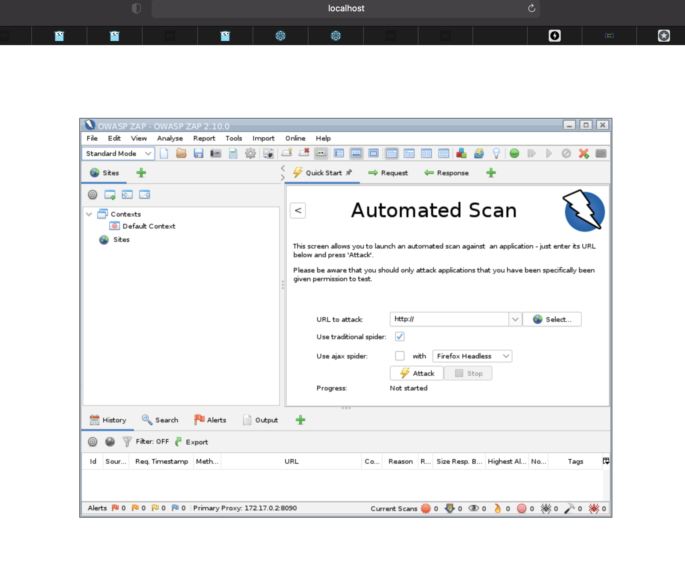

# Introduction

This project is an example to do a owasp testing using the oficial owasp/zap image

# How to test

1. Deploy your app. In this case you can run:

```bash
    go run server.go
```

2. Run owasp/zap container:

```bash
docker run -it --name sectest -v results:/zap/wrk/ owasp/zap2docker-stable python zap-baseline.py -t http://host.docker.internal:8882/random -x mireportxm.xml -r mireporthtml.html
```

# Also you can run the owasp/zap aplication using

```bash
docker run -u zap -p 8080:8080 -p 8090:8090 -i owasp/zap2docker-stable zap-webswing.sh
```

Then go to http://localhost:8080/zap/ in your browser:



# Reference

https://www.zaproxy.org/docs/docker/about/